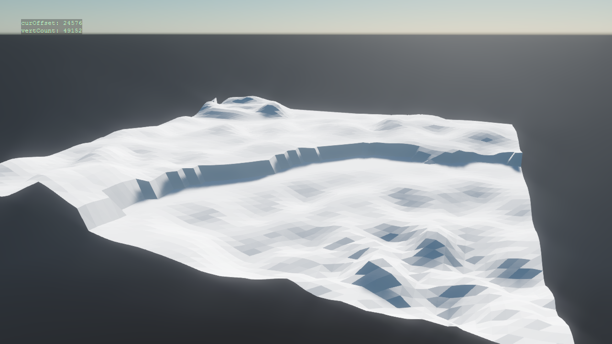

XenkoByteSized
---------------
Intended as a sort of dumping ground for various small samples of using Xenko to do various things, like procedurally generate meshes.

Project is currently on **Xenko 3.1.0.1-beta02**.

## [XenkoByteSized.ProceduralMesh.TetrahedronMesh](XenkoByteSized/XenkoByteSized.Game/ProceduralMesh/TetrahedronMesh.cs)
A simple example of creating a mesh procedurally by supplying vertices, also calculates normals automatically. Can be observed in the scene that loads when you open the project aside from the source itself.

Uses only a vertex buffer to be as simple as possible.

## [XenkoByteSized.ProceduralMesh.SubdividedPlaneMesh](XenkoByteSized/XenkoByteSized.Game/ProceduralMesh/SubdividedPlaneMesh.cs)

A somewhat less simple example of expanding upon the above, generates a subdivded plane with a configurable width, height and number of subdivisions in each quadrant.

Still does not use any index buffer, probably should.

Has some basic operations possible like:
 * Lowering/Raising terrain (Left/Middle Mouse)
 * Smoothing terrain (Shift + Left Mouse)
 * Leveling terrain (Ctrl + Left Mouse)

Can also be observed in the same scene

